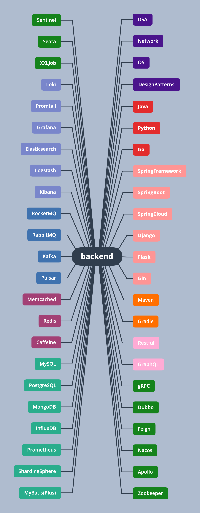

<h1 align="center">📝backend</h1>

> 后端开发全记录，持续更新中...

## 思维导图

[思维导图源文件](resources/backend.xmind)

## 项目文章

[后端开发全记录 持续更新 - 博客园](https://www.cnblogs.com/parzulpan/p/14129822.html)

## 参考

### 链接

* [可能是一份最适合你的后端面试指南](https://juejin.im/post/6844903683658874893)：面试前一天，**必看**
* [Java 工程师进阶知识](https://github.com/doocs/advanced-java)：进阶知识，**必看**
* [Java 学习 + 面试指南](https://github.com/Snailclimb/JavaGuide)：面试突击，**必看**
* [技术面试基础知识总结](https://github.com/huihut/interview)：面试突击，**必看**
* [Java 面试 + Java 学习指南](https://github.com/AobingJava/JavaFamily)：经验面经，**选看**
* [技术面试必备基础知识](https://github.com/CyC2018/CS-Notes)：日常细看，**选看**
* [Java 工程师面试复习指南](https://github.com/h2pl/Java-Tutorial)
* [互联网面试笔记](https://github.com/zhengjianglong915/note-of-interview)
* [互联网公司经典技术架构](https://github.com/davideuler/architecture.of.internet-product)
* [大厂 TopK 面试题](https://osjobs.net/topk/)
* [技术面试最后反问面试官的话](https://github.com/yifeikong/reverse-interview-zh)
* [Spring 生态简介](https://www.cnblogs.com/nuccch/p/10958254.html)

### 书籍

* [《数据结构与算法分析 Java 语言描述》](https://book.douban.com/subject/3351237/)
* [《深入理解Java虚拟机（第3版）》](https://book.douban.com/subject/34907497/)

### 文档

* [Spring 全家桶](https://spring.io/projects/spring-boot)

## 协议

本项目遵循 GNU General Public License v3.0，如果要修改源码进行二次开发需要遵守以下协议：

* 如果要在网络上分发，那么必须开源；
* 不能以盈利为目的，不能插入任何形式的广告；
* 注明原项目出处；
* 继承相同协议。